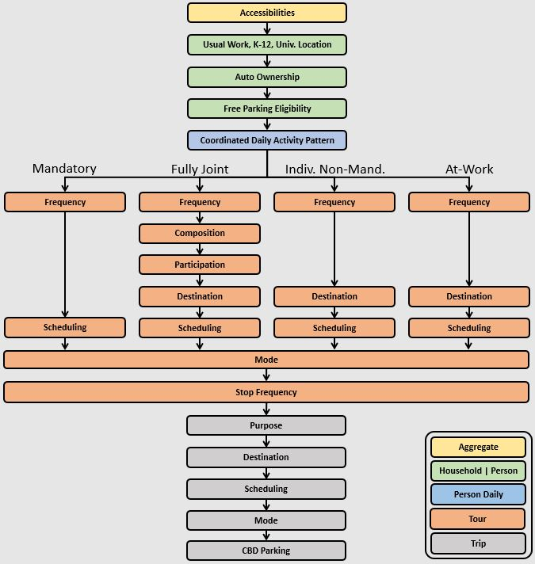

.. _example :

Example
=======

This page describes the example model design and how to setup and run the example. The default 
configuration of the example is limited to a small sample of households and zones so that it can 
be run quickly and require less than 1 GB of RAM.  The full scale example can be configurd and run 
as well.

.. index:: tutorial
.. index:: example

Example Model Design
--------------------

The example AB model implemented with the activitysim framework is 
`Bay Area Metro Travel Model One <https://github.com/BayAreaMetro/travel-model-one>`__ (TM1).  
TM1 has its roots in a wide array of analytical approaches, including discrete
choice forms (multinomial and nested logit models), activity duration models, time-use models,
models of individual micro-simulation with constraints, entropy-maximization models, etc.
These tools are combined in the model design to realistically represent travel behavior,
adequately replicate observed activity-travel patterns, and ensure model sensitivity to
infrastructure and policies. The model is implemented in a micro-simulation framework. Microsimulation
methods capture aggregate outcomes through the representation of the behavior of
individual decision-makers.  

Space
~~~~~

TM1 uses the 1454-zone system developed for MTC's previous trip-based model.  The zones are fairly large, 
which may distort the representation of transit access in mode choice. To ameliorate this problem, the 
zones were further sub-divided into three categories of transit access: short walk, long walk, and not walkable. 

However, support for transit subzones is not included in the activitysim implementation since the latest generation
of activity-based models typically use multiple zone systems instead.  In brief, all households are assigned to microzones 
(such as Census blocks) and trips are assigned to origin and destination microzones.  When considering network
level-of-service (LOS) indicators, different spatial resolutions are used for different modes.  For example:

  * TAZs are used for auto network modeling and skims
  * Microzones are used for nearby non-motorized mode (walk and bike) network modeling and skims
  * Transit access points (TAPs) (or transit catchment areas) are used for transit network modeling and skims

In the demand model, transit virtual path building (TVPB) is done to generate LOS measures from:

  * the trip's origin microzone to a select number of nearby TAPs using microzone to TAP LOS measures
  * boarding TAP to alighting TAP LOS measures (TAP to TAP skims)
  * alighting TAP to destination microzone using microzone to TAP LOS measures

The resulting complete transit path LOS for the "best" or a "bundle" of paths is then used in the demand model
for representing transit LOS at the microzone level.  This functionality is **NOT YET IMPLEMENTED**.

Decision-making units
~~~~~~~~~~~~~~~~~~~~~

Decision-makers in the model system are households and persons. These decision-makers are
created for each simulation year based on a population synthesis process such as 
`PopulationSim <https://github.com/RSGInc/PopulationSim>`__. The decision-makers are used in the 
subsequent discrete-choice models to select a single alternative from a list of available 
alternatives according to a probability distribution. The probability distribution is generated 
from various logit-form models which take into account the attributes of the decision-maker and 
the attributes of the various alternatives. The decision-making unit is an important element of 
model estimation and implementation, and is explicitly identified for each model.

Person type segmentation
~~~~~~~~~~~~~~~~~~~~~~~~

TM1 is implemented in a micro-simulation framework. A key advantage of the
micro-simulation approach is that there are essentially no computational constraints on the
number of explanatory variables which can be included in a model specification. However, even
with this flexibility, the model system includes some segmentation of decision-makers.
Segmentation is a useful tool both to structure models and also as a way to characterize person
roles within a household.

The person types shown below are used for the example model. The person types are mutually exclusive 
with respect to age, work status, and school status.

+-----------------------------------------------------------+---------+------------------+---------------+
| Person Type                                               | Age     | Work Status      | School Status |
+===========================================================+=========+==================+===============+
| Full-time worker (30+ hours a week)                       | 18+     | Full-time        | None          |
+-----------------------------------------------------------+---------+------------------+---------------+
| Part-time worker (<30 hours but works on a regular basis) | 18+     | Part-time        | None          |
+-----------------------------------------------------------+---------+------------------+---------------+
| Non-working adult                                         | 18 - 64 | Unemployed       | None          |
+-----------------------------------------------------------+---------+------------------+---------------+
| Retired person                                            | 65+     | Unemployed       | None          |
+-----------------------------------------------------------+---------+------------------+---------------+
| College student                                           | 18+     | Any              | College       |
+-----------------------------------------------------------+---------+------------------+---------------+
| Driving age student                                       | 16 - 17 | Any              | Pre-college   |
+-----------------------------------------------------------+---------+------------------+---------------+
| Non-driving student                                       | 6 - 16  | None             | Pre-college   |
+-----------------------------------------------------------+---------+------------------+---------------+
| Pre-school child                                          | 0 - 5   | None             | None          |
+-----------------------------------------------------------+---------+------------------+---------------+

Household type segments are useful for pre-defining certain data items (such as destination
choice size terms) so that these data items can be pre-calculated for each segment. Precalculation
of these data items reduces model complexity and runtime. The segmentation is based on household income, 
and includes four segments - low, medium, high, very high.

In the model, the persons in each household are assigned a simulated but fixed "value of time"
that modulates the relative weight the decision-maker places on time and cost. The probability
distribution from which the value of time is sampled was derived from a toll choice model
estimated using data from a stated preference survey performed for the SFCTA's Mobility, Access, and 
Pricing Study, and is a lognormal distribution with a mean that varies by income segment.  
Value of time assignment is **NOT YET IMPLEMENTED**.

Activity type segmentation
~~~~~~~~~~~~~~~~~~~~~~~~~~

The activity types are used in most model system components, from developing daily activity patterns 
and to predicting tour and trip destinations and modes by purpose.  The set of activity types is shown below. 
The activity types are also grouped according to whether the activity is mandatory or non-mandatory and 
eligibility requirements are assigned determining which person-types can be used for generating each 
activity type. The classification scheme of each activity type reflects the relative importance or 
natural hierarchy of the activity, where work and school activities are typically the most inflexible 
in terms of generation, scheduling and location, and discretionary activities are typically the most 
flexible on each of these dimensions. Each out-of-home location that a person travels to in the 
simulation is assigned one of these activity types.

+---------------------+--------------------------------------------------------------------------+---------------+---------------------------------------+
| Purpose             | Description                                                              | Classification| Eligibility                           |
+=====================+==========================================================================+===============+=======================================+
| Work                | Working at regular workplace or work-related activities outside the home | Mandatory     | Workers and students                  |
+---------------------+--------------------------------------------------------------------------+---------------+---------------------------------------+
| University          | College or University                                                    | Mandatory     | Age 18+                               |
+---------------------+--------------------------------------------------------------------------+---------------+---------------------------------------+
| High School         | Grades 9-12                                                              | Mandatory     | Age 14-17                             |
+---------------------+--------------------------------------------------------------------------+---------------+---------------------------------------+
| Grade School        | Grades K-8                                                               | Mandatory     | Age 5-13                              |
+---------------------+--------------------------------------------------------------------------+---------------+---------------------------------------+
| Escorting           | Pick-up/drop-off passengers (auto trips only)                            | NonMandatory  | Age 16+                               |
+---------------------+--------------------------------------------------------------------------+---------------+---------------------------------------+
| Shopping            | Shopping away from home                                                  | NonMandatory  | Age 5+ (if joint travel, all persons) |
+---------------------+--------------------------------------------------------------------------+---------------+---------------------------------------+
| Other Maintenance   | Personal business/services and medical appointments                      | NonMandatory  | Age 5+ (if joint travel, all persons) |
+---------------------+--------------------------------------------------------------------------+---------------+---------------------------------------+
| Social/Recreational | Recreation, visiting friends/family                                      | NonMandatory  | Age 5+ (if joint travel, all persons) |
+---------------------+--------------------------------------------------------------------------+---------------+---------------------------------------+
| Eat Out             | Eating outside of home                                                   | NonMandatory  | Age 5+ (if joint travel, all persons) |
+---------------------+--------------------------------------------------------------------------+---------------+---------------------------------------+
| Other Discretionary | Volunteer work, religious activities                                     | NonMandatory  | Age 5+ (if joint travel, all persons) |
+---------------------+--------------------------------------------------------------------------+---------------+---------------------------------------+

Treatment of time
~~~~~~~~~~~~~~~~~

The model system functions at a temporal resolution of one hour. These one hour increments
begin with 3 AM and end with 3 AM the next day. Temporal integrity is ensured so that no
activities are scheduled with conflicting time windows, with the exception of short
activities/tours that are completed within a one hour increment. For example, a person may have
a short tour that begins and ends within the 8 AM to 9 AM period, as well as a second longer tour
that begins within this time period, but ends later in the day.

A critical aspect of the model system is the relationship between the temporal resolution used for
scheduling activities and the temporal resolution of the network assignment periods. Although
each activity generated by the model system is identified with a start time and end time in one hour
increments, LOS matrices are only created for five aggregate time periods. The trips occurring in each time period
reference the appropriate transport network depending on their trip mode and the mid-point trip
time. The definition of time periods for LOS matrices is given below.

+---------------+-------------------+
|  Time Period  | Start to End Hour |
+===============+===================+
|  EA           |  3 to 6           |
+---------------+-------------------+
|  AM           |  6 to 10          |
+---------------+-------------------+
|  MD           |  11 to 15         |
+---------------+-------------------+
|  PM           |  15 to 19         |
+---------------+-------------------+
|  EV           |  19 to 3          |
+---------------+-------------------+

Trip modes
~~~~~~~~~~

The trip modes defined in the example model are below. The modes include auto by
occupancy and toll/non-toll choice, walk and bike, and walk and drive access to five different
transit line-haul modes.

  1. Auto - SOV (Free)
  2. Auto - SOV (Pay)
  3. Auto - 2 Person (Free)
  4. Auto - 2 Person (Pay)
  5. Auto - 3+ Person (Free)
  6. Auto - 3+ Person (Pay)
  7. Walk
  8. Bike
  9. Walk to Local Bus
  10. Walk to Light-Rail Transit
  11. Walk to Express Bus
  12. Walk to Bus Rapid Transit
  13. Walk to Heavy Rail
  14. Drive to Local Bus
  15. Drive to Light-Rail Transit
  16. Drive to Express Bus
  17. Drive to Bus Rapid Transit
  18. Drive to Heavy Rail 

Sub-models
~~~~~~~~~~

The general design of the example model is presented below.  Long-term choices that relate to 
the usual workplace/university/school for each worker and student, household car ownership, and the
availability of free parking at workplaces are first.

The coordinated daily activity pattern type of each household member is the first travel-related
sub-model in the hierarchy. This model classifies daily patterns by three types:

  * Mandatory, which includes at least one out-of-home mandatory activity (work or school)
  * Non-mandatory, which includes at least one out-of-home non-mandatory activity, but does not include out-of-home mandatory activities
  * Home, which does not include any out-of-home activity or travel

The pattern type sub-model leaves open the frequency of tours for mandatory and nonmandatory
purposes since these sub-models are applied later in the model sequence. Daily
pattern-type choices of the household members are linked in such a way that decisions made by
members are reflected in the decisions made by the other members.

After the frequency and time-of-day for work and school tours are determined, the
next major model component relates to joint household travel. This component produces a
number of joint tours by travel purpose for the entire household, travel party composition
in terms of adults and children, and then defines the participation of each household
member in each joint household tour. It is followed by choice of destination and time-ofday.

The next stage relates to maintenance and discretionary tours that are modeled at the individual
person level. The models include tour frequency, choice of destination and time
of day. Next, a set of sub-models relate tour-level details on mode, exact number of
intermediate stops on each half-tour and stop location. It is followed by the last set of
sub-models that add details for each trip including trip departure time, trip mode details and parking 
location for auto trips.

The output of the model is a disggregate table of trips with individual attributes for custom analysis.  The trips
can be aggregated into travel demand matrices for network loading.

Setup
-----

The following describes the example model setup.

Folder and File Setup
~~~~~~~~~~~~~~~~~~~~~

The example has the following root folder/file setup:

  * configs - settings, expressions files, etc.
  * data - input data such as land use, synthetic population files, and skims
  * simulation.py - main script to run the model
    
Inputs
~~~~~~

In order to run the example, you first need two input files in the ``data`` folder as identified in the ``configs\settings.yaml`` file:

* store: mtc_asim.h5 - an HDF5 file containing the following MTC TM1 tables as pandas DataFrames for a subset of zones:

    * skims/accessibility - Zone-based accessibility measures
    * land_use/taz_data - Zone-based land use data (population and employment for example)
    * persons - Synthetic population person records
    * households - Synthetic population household records
    
* skims_file: skims.omx - an OMX matrix file containing the MTC travel model one skim matrices for a subset of zones.

Both files are used in the tests as well and are in the ``activitysim\abm\test\data`` folder.  Alternatively, 
these files can be downloaded from the SF_25_zone_example folder on 
MTC's `box account <https://mtcdrive.app.box.com/v/activitysim>`__.  The full set of MTC 
TM1 OMX skims are also on the box account. 

.. note::

  Input files can be viewed with the `OMX Viewer <https://github.com/osPlanning/omx/wiki/OMX-Viewer>`__.  

  The ``scripts\data_mover.ipynb`` was used to create the mtc_asim.h5 file from the raw CSV files.  
  This script reads the CSV files, creates DataFrame indexes, and writes the pandas objects to the HDF5 file.

  The ``scripts\build_omx.py`` script will build one OMX file containing all the skims. The original MTC TM1 skims were converted from 
  Cube to OMX using the `Cube to OMX converter <https://github.com/osPlanning/omx/wiki/Cube-OMX-Converter>`__.

  The example inputs were created by the ``scripts\create_sf_example.py`` script, which creates the land use, synthetic population, and skim inputs for a subset of user-defined zones.

Configuration
~~~~~~~~~~~~~

The ``configs`` folder contains settings, expressions files, and other files required for specifying 
model utilities and form.  The first place to start in the ``configs`` folder is ``settings.yaml``, which 
is the main settings file for the model run.  This file includes:

* ``models`` - list of model steps to run - auto ownership, tour frequency, etc. - see :ref:`model_steps`
* ``store`` - HDF5 inputs file
* ``skims_file`` - skim matrices in one OMX file
* ``households_sample_size`` - number of households to sample and simulate; comment out to simulate all households
* ``trace_hh_id`` - trace household id; comment out for no trace
* ``trace_od`` - trace origin, destination pair in accessibility calculation; comment out for no trace
* ``chunk_size`` - batch size for processing choosers, see :ref:`chunk_size`
* ``check_for_variability`` - disable check for variability in an expression result debugging feature in order to speed-up runtime
* global variables that can be used in expressions tables and Python code such as:

    * ``urban_threshold`` - urban threshold area type max value
    * ``county_map`` - mapping of county codes to county names
    * ``skim_time_periods`` - time period upper bound values and labels

.. _sub-model-spec-files:

Sub-Model Specification Files
~~~~~~~~~~~~~~~~~~~~~~~~~~~~~

Included in the ``configs`` folder are the model specification files that store the 
Python/pandas/numpy expressions, alternatives, and other settings used by each model.  Some models includes an 
alternatives file since the alternatives are not easily described as columns in the expressions file.  An example
of this is the ``non_mandatory_tour_frequency_alternatives.csv`` file, which lists each alternative as a row and each 
columns indicates the number of non-mandatory tours by purpose.  The current set of files are below.

+------------------------------------------------+--------------------------------------------------------------------+
|            Model                               |    Specification Files                                             |
+================================================+====================================================================+
|  :ref:`accessibility`                          |  - accessibility.yaml                                              |
|                                                |  - accessibility.csv                                               |
+------------------------------------------------+--------------------------------------------------------------------+
|   :ref:`school_location`                       |  - school_location.yaml                                            |
|                                                |  - annotate_persons_school.csv                                     |
|                                                |  - school_location_sample.csv                                      |
|                                                |  - logsums.yaml                                                    |
|                                                |                                                                    |
|                                                |    - logsums_annotate_choosers_preprocessor.csv                    |
|                                                |    - logsums_spec.csv                                              |
|                                                |    - logsums_coeffs.csv                                            |
|                                                |                                                                    |
|                                                |  - school_location.csv                                             |
|                                                |  - destination_choice_size_terms.csv                               |
+------------------------------------------------+--------------------------------------------------------------------+
|    :ref:`work_location`                        |  - workplace_location.yaml                                         |
|                                                |  - annotate_persons_workplace.csv                                  |
|                                                |  - workplace_location_sample.csv                                   |
|                                                |  - logsums.yaml                                                    |
|                                                |                                                                    |
|                                                |    - logsums_annotate_choosers_preprocessor.csv                    |
|                                                |    - logsums_spec.csv                                              |
|                                                |    - logsums_coeffs.csv                                            |
|                                                |                                                                    |
|                                                |  - workplace_location.csv                                          |
|                                                |  - destination_choice_size_terms.csv                               |
+------------------------------------------------+--------------------------------------------------------------------+
| :ref:`auto_ownership`                          |  - auto_ownership.yaml                                             |
|                                                |  - auto_ownership.csv                                              |
+------------------------------------------------+--------------------------------------------------------------------+
| :ref:`freeparking`                             |  **NOT YET IMPLEMENTED**                                           |
|                                                |                                                                    |
+------------------------------------------------+--------------------------------------------------------------------+
| :ref:`cdap`                                    |  - cdap.yaml                                                       |
|                                                |  - annotate_persons_cdap.csv                                       |
|                                                |  - annotate_households_cdap.csv                                    |
|                                                |  - cdap_indiv_and_hhsize1.csv                                      |
|                                                |  - cdap_interaction_coefficients.csv                               |
|                                                |  - cdap_fixed_relative_proportions.csv                             |
+------------------------------------------------+--------------------------------------------------------------------+
|  :ref:`mandatory_tour_frequency`               |  - mandatory_tour_frequency.yaml                                   |
|                                                |  - mandatory_tour_frequency.csv                                    |
|                                                |  - annotate_persons_mtf.csv                                        |
|                                                |  - mandatory_tour_frequency_alternatives.csv                       |
+------------------------------------------------+--------------------------------------------------------------------+
| :ref:`mandatory_tour_scheduling`               |  - mandatory_tour_scheduling.yaml                                  |
|                                                |  - tour_scheduling_work.csv                                        |
|                                                |  - tour_scheduling_school.csv                                      |
|                                                |  - tour_departure_and_duration_alternatives.csv                    |
+------------------------------------------------+--------------------------------------------------------------------+
| :ref:`joint_tour_frequency`                    |  - joint_tour_frequency.yaml                                       |
|                                                |  - joint_tour_frequency_annotate_households_preprocessor.csv       |
|                                                |  - joint_tour_frequency_alternatives.csv                           |
+------------------------------------------------+--------------------------------------------------------------------+
| :ref:`joint_tour_composition`                  |  - joint_tour_composition.yaml                                     |
|                                                |  - joint_tour_composition_annotate_households_preprocessor.csv     |
|                                                |  - joint_tour_composition.csv                                      |
+------------------------------------------------+--------------------------------------------------------------------+
| :ref:`joint_tour_participation`                |  - joint_tour_participation.yaml                                   |
|                                                |  - joint_tour_participation_annotate_participants_preprocessor.csv |
|                                                |  - joint_tour_participation.csv                                    |
+------------------------------------------------+--------------------------------------------------------------------+
| :ref:`joint_tour_destination_choice`           |  - joint_tour_destination.yaml                                     |
|                                                |  - non_mandatory_tour_destination_sample.csv                       |
|                                                |  - non_mandatory_tour_destination.csv                              |
|                                                |  - logsums.yaml                                                    |
|                                                |                                                                    |
|                                                |    - logsums_annotate_choosers_preprocessor.csv                    |
|                                                |    - logsums_spec.csv                                              |
|                                                |    - logsums_coeffs.csv                                            |
|                                                |                                                                    |
|                                                |  - destination_choice_size_terms.csv                               |
+------------------------------------------------+--------------------------------------------------------------------+
| :ref:`joint_tour_scheduling`                   |  - joint_tour_scheduling.yaml                                      |
|                                                |  - joint_tour_scheduling_annotate_tours_preprocessor.csv           |
|                                                |  - tour_scheduling_joint.csv                                       |
|                                                |  - tour_departure_and_duration_alternatives.csv                    |
+------------------------------------------------+--------------------------------------------------------------------+
| :ref:`joint_tour_mode_choice`                  |  - joint_tour_mode_choice.yaml                                     |
|                                                |  - tour_mode_choice_annotate_tours_preprocessor1.csv               |
|                                                |  - tour_mode_choice_annotate_tours_preprocessor2.csv               |
|                                                |  - tour_mode_choice.yaml                                           |
|                                                |  - tour_mode_choice.csv                                            |
|                                                |  - tour_mode_choice_coeffs.csv                                     |
+------------------------------------------------+--------------------------------------------------------------------+
| :ref:`non_mandatory_tour_frequency`            |  - non_mandatory_tour_frequency.yaml                               |
|                                                |  - non_mandatory_tour_frequency.csv                                |
|                                                |  - non_mandatory_tour_frequency_alternatives.csv                   |
|                                                |  - annotate_persons_nmtf.csv                                       |
+------------------------------------------------+--------------------------------------------------------------------+
| :ref:`non_mandatory_tour_destination_choice`   |  - non_mandatory_tour_destination_choice.yaml                      |
|                                                |  - non_mandatory_tour_destination.csv (**NOT YET IMPLEMENTED**)    |
|                                                |  - non_mandatory_tour_destination_sample.csv                       |
|                                                |  - destination_choice_size_terms.csv                               |
+------------------------------------------------+--------------------------------------------------------------------+
| :ref:`non_mandatory_tour_scheduling`           |  - non_mandatory_tour_scheduling.yaml                              |
|                                                |  - non_mandatory_tour_scheduling_annotate_tours_preprocessor       |
|                                                |  - tour_scheduling_nonmandatory.csv                                |
|                                                |  - tour_departure_and_duration_alternatives.csv                    |
+------------------------------------------------+--------------------------------------------------------------------+
| :ref:`man_non-man_tour_mode_choice`            |  - tour_mode_choice.yaml                                           |
|                                                |  - tour_mode_choice_annotate_tours_preprocessor1.csv               |
|                                                |  - tour_mode_choice_annotate_tours_preprocessor2.csv               |
|                                                |  - tour_mode_choice.csv                                            |
|                                                |  - tour_mode_choice_coeffs.csv                                     |
+------------------------------------------------+--------------------------------------------------------------------+
|  :ref:`atwork_subtour_frequency`               |  - atwork_subtour_frequency.yaml                                   |
|                                                |  - atwork_subtour_frequency.csv                                    |
|                                                |  - atwork_subtour_frequency_alternatives.csv                       |
+------------------------------------------------+--------------------------------------------------------------------+
|   :ref:`atwork_subtour_destination`            |  - atwork_subtour_destination.yaml                                 |
|                                                |  - atwork_subtour_destination_sample.csv                           |
|                                                |  - atwork_subtour_destination.csv                                  |
|                                                |  - logsums.yaml                                                    |
|                                                |                                                                    |
|                                                |    - logsums_annotate_choosers_preprocessor.csv                    |
|                                                |    - logsums_spec.csv                                              |
|                                                |    - logsums_coeffs.csv                                            |
|                                                |                                                                    |
|                                                |  - destination_choice_size_terms.csv                               |
+------------------------------------------------+--------------------------------------------------------------------+
| :ref:`atwork_subtour_scheduling`               |  - atwork_subtour_scheduling.yaml                                  |
|                                                |  - tour_scheduling_atwork.csv                                      |
|                                                |  - tour_departure_and_duration_alternatives.csv                    |
+------------------------------------------------+--------------------------------------------------------------------+
|  :ref:`atwork_subtour_mode_choice`             |  - atwork_subtour_mode_choice.yaml                                 |
|                                                |  - tour_mode_choice_annotate_tours_preprocessor1.csv               |
|                                                |  - tour_mode_choice_annotate_tours_preprocessor2.csv               |
|                                                |  - tour_mode_choice.yaml                                           |
|                                                |  - tour_mode_choice.csv                                            |
|                                                |  - tour_mode_choice_coeffs.csv                                     |
+------------------------------------------------+--------------------------------------------------------------------+
|  :ref:`intermediate_stop_frequency`            |  - stop_frequency.yaml                                             |
|                                                |  - stop_frequency_annotate_tours_preprocessor.csv                  |
|                                                |  - stop_frequency_alternatives.csv                                 |
|                                                |  - stop_frequency_atwork.csv                                       |
|                                                |  - stop_frequency_eatout.csv                                       |
|                                                |  - stop_frequency_escort.csv                                       |
|                                                |  - stop_frequency_othdiscr.csv                                     |
|                                                |  - stop_frequency_othmaint.csv                                     |
|                                                |  - stop_frequency_school.csv                                       |
|                                                |  - stop_frequency_shopping.csv                                     |
|                                                |  - stop_frequency_social.csv                                       |
|                                                |  - stop_frequency_subtour.csv                                      |
|                                                |  - stop_frequency_univ.csv                                         |
|                                                |  - stop_frequency_work.csv                                         |
+------------------------------------------------+--------------------------------------------------------------------+
|  :ref:`trip_purpose`                           |  - trip_purpose.yaml (+ trip_purpose_and_destination.yaml)         |
|                                                |  - trip_purpose_annotate_trips_preprocessor.csv                    |
|                                                |  - trip_purpose_probs.csv                                          |
+------------------------------------------------+--------------------------------------------------------------------+
|  :ref:`trip_destination_choice`                |  - trip_destination.yaml (+ trip_purpose_and_destination.yaml)     |
|                                                |  - trip_destination_annotate_trips_preprocessor.csv                |
|                                                |  - trip_destination_sample.csv                                     |
|                                                |  - logsums.yaml                                                    |
|                                                |                                                                    |
|                                                |    - logsums_annotate_choosers_preprocessor.csv                    |
|                                                |    - logsums_spec.csv                                              |
|                                                |    - logsums_coeffs.csv                                            |
|                                                |                                                                    |
|                                                |  - destination_choice_size_terms.csv                               |
+------------------------------------------------+--------------------------------------------------------------------+
|  :ref:`trip_scheduling`                        |  - trip_scheduling.yaml                                            |
|                                                |  - trip_scheduling_probs.csv                                       |
+------------------------------------------------+--------------------------------------------------------------------+
|  :ref:`trip_mode_choice`                       |  **NOT YET IMPLEMENTED**                                           |
+------------------------------------------------+--------------------------------------------------------------------+
|  :ref:`trip_cbd_parking`                       |  **NOT YET IMPLEMENTED**                                           |
+------------------------------------------------+--------------------------------------------------------------------+

.. index:: chunk_size
.. _chunk_size:

Chunk size
~~~~~~~~~~

The ``chunk_size`` is the number of doubles in a chunk of the choosers table.  It is approximately the number 
of rows times the number of columns and it needs to be set to a value that efficiently processes the table with 
the available RAM.  For example, a chunk size of 1,000,000 could be 100,000 household records with 10 columns of attributes.  
Setting the chunk size too high will run into memory errors such as ``OverflowError: Python int 
too large to convert to C long.`` Setting the chunk size too low may result in smaller than optimal vector
lengths, which may waste runtime.  The chunk size is dependent on the size of the population, the complexity 
of the utility expressions, the amount of RAM on the machine, and other problem specific dimensions.  Thus, 
it needs to be set via experimentation.

Logging
~~~~~~~

Included in the ``configs`` folder is the ``logging.yaml``, which configures Python logging 
library and defines two key log files: 

* ``asim.log`` - overall system log file
* ``hhtrace.log`` - household trace log file if tracing is on

Refer to the :ref:`tracing` section for more detail on tracing.

Running the Example
-------------------

To run the example, do the following:

* Open a command line window in the ``example`` folder
* Activate the correct conda environment if needed
* Run ``python simulation.py`` to run the data pipeline (i.e. model steps)
* ActivitySim should log some information and write outputs to the ``outputs`` folder.  

The example should complete within a couple minutes since it is running a small sample of households.

.. _model_steps :

Pipeline
~~~~~~~~

The ``models`` setting contains the specification of the data pipeline model steps, as shown below:

::

 models:
    - initialize
    - compute_accessibility
    - school_location_sample
    - school_location_logsums
    - school_location_simulate
    - workplace_location_sample
    - workplace_location_logsums
    - workplace_location_simulate
    - auto_ownership_simulate
    - cdap_simulate
    - mandatory_tour_frequency
    - mandatory_tour_scheduling
    - joint_tour_frequency
    - joint_tour_composition
    - joint_tour_participation
    - joint_tour_destination_sample
    - joint_tour_destination_logsums
    - joint_tour_destination_simulate
    - joint_tour_scheduling
    - joint_tour_mode_choice
    - non_mandatory_tour_frequency
    - non_mandatory_tour_destination
    - non_mandatory_tour_scheduling
    - tour_mode_choice_simulate
    - atwork_subtour_frequency
    - atwork_subtour_destination_sample
    - atwork_subtour_destination_logsums
    - atwork_subtour_destination_simulate
    - atwork_subtour_scheduling
    - atwork_subtour_mode_choice
    - stop_frequency
    - trip_purpose
    - trip_destination
    - trip_purpose_and_destination
    - trip_scheduling
    - write_data_dictionary
    - write_tables

These model steps must be registered orca steps, as noted below.  If you provide a ``resume_after`` 
argument to :func:`activitysim.core.pipeline.run` the pipeliner will load checkpointed tables from the checkpoint store 
and resume pipeline processing on the next model step after the specified checkpoint.  

::

  resume_after = None
  #resume_after = 'school_location_logsums'

The model is run by calling the :func:`activitysim.core.pipeline.run` method.

::

  pipeline.run(models=_MODELS, resume_after=resume_after)

Outputs
-------

The key output of ActivitySim is the HDF5 data pipeline file ``outputs\pipeline.h5``.  This file contains a copy 
of each key data table after each model step in which the table was modified.  The 
``scripts\make_pipeline_output.py`` script uses the information stored in the pipeline file to create the table 
below for a small sample of households.  The table shows that for each table in the pipeline, the number of rows 
and/or columns changes as a result of the relevant model step.  A ``checkpoints`` table is also stored in the 
pipeline, which contains the crosswalk between model steps and table states in order to reload tables for 
restarting the pipeline at any step.

+-----------------------------------+------------------------------------+------+------+
| Table                             | Creator                            | NRow | NCol |
+===================================+====================================+======+======+ 
| accessibility                     | compute_accessibility              | 10   | 25   |
+-----------------------------------+------------------------------------+------+------+
| atwork_subtour_destination_sample | atwork_subtour_destination_sample  | 4    | 125  |
+-----------------------------------+------------------------------------+------+------+
| atwork_subtour_destination_sample | atwork_subtour_destination_logsums | 5    | 125  |
+-----------------------------------+------------------------------------+------+------+
| households                        | initialize                         | 64   | 100  |
+-----------------------------------+------------------------------------+------+------+
| households                        | cdap_simulate                      | 68   | 100  |
+-----------------------------------+------------------------------------+------+------+
| households                        | joint_tour_frequency               | 70   | 100  |
+-----------------------------------+------------------------------------+------+------+
| joint_tour_destination_sample     | joint_tour_destination_sample      | 5    | 29   |
+-----------------------------------+------------------------------------+------+------+
| joint_tour_destination_sample     | joint_tour_destination_logsums     | 6    | 29   |
+-----------------------------------+------------------------------------+------+------+
| joint_tour_participants           | joint_tour_participation           | 4    | 4    |
+-----------------------------------+------------------------------------+------+------+
| land_use                          | initialize                         | 45   | 25   |
+-----------------------------------+------------------------------------+------+------+
| person_windows                    | initialize                         | 21   | 153  |
+-----------------------------------+------------------------------------+------+------+
| persons                           | initialize                         | 40   | 153  |
+-----------------------------------+------------------------------------+------+------+
| persons                           | school_location_simulate           | 43   | 153  |
+-----------------------------------+------------------------------------+------+------+
| persons                           | workplace_location_simulate        | 48   | 153  |
+-----------------------------------+------------------------------------+------+------+
| persons                           | cdap_simulate                      | 54   | 153  |
+-----------------------------------+------------------------------------+------+------+
| persons                           | mandatory_tour_frequency           | 59   | 153  |
+-----------------------------------+------------------------------------+------+------+
| persons                           | non_mandatory_tour_frequency       | 64   | 153  |
+-----------------------------------+------------------------------------+------+------+
| school_location_sample            | school_location_sample             | 4    | 138  |
+-----------------------------------+------------------------------------+------+------+
| school_location_sample            | school_location_logsums            | 5    | 138  |
+-----------------------------------+------------------------------------+------+------+
| tours                             | mandatory_tour_frequency           | 11   | 68   |
+-----------------------------------+------------------------------------+------+------+
| tours                             | mandatory_tour_scheduling          | 15   | 68   |
+-----------------------------------+------------------------------------+------+------+
| tours                             | joint_tour_composition             | 16   | 70   |
+-----------------------------------+------------------------------------+------+------+
| tours                             | joint_tour_mode_choice             | 17   | 70   |
+-----------------------------------+------------------------------------+------+------+
| tours                             | atwork_subtour_frequency           | 19   | 189  |
+-----------------------------------+------------------------------------+------+------+
| tours                             | stop_frequency                     | 21   | 189  |
+-----------------------------------+------------------------------------+------+------+
| trips                             | stop_frequency                     | 10   | 464  |
+-----------------------------------+------------------------------------+------+------+
| trips                             | trip_purpose                       | 11   | 464  |
+-----------------------------------+------------------------------------+------+------+
| trips                             | trip_destination                   | 14   | 464  |
+-----------------------------------+------------------------------------+------+------+
| trips                             | trip_scheduling                    | 15   | 464  |
+-----------------------------------+------------------------------------+------+------+
| workplace_location_sample         | workplace_location_sample          | 3    | 889  |
+-----------------------------------+------------------------------------+------+------+
| workplace_location_sample         | workplace_location_logsums         | 4    | 889  |
+-----------------------------------+------------------------------------+------+------+

The example ``simulation.py`` run model script also writes the final tables to CSV files
for illustrative purposes by using the :func:`activitysim.core.pipeline.get_table` method.  This method
returns a pandas DataFrame, which can then be written to a CSV with the ``to_csv(file_path)`` method.

ActivitySim also writes log and trace files to the ``outputs`` folder.  The asim.log file, which
is the overall log file is always produced.  If tracing is specified, then trace files are output
as well.

.. _tracing :

Tracing
~~~~~~~

There are two types of tracing in ActivtiySim: household and origin-destination (OD) pair.  If a household trace ID 
is specified, then ActivitySim will output a comprehensive set of trace files for all 
calculations for all household members:

* ``hhtrace.log`` - household trace log file, which specifies the CSV files traced. The order of output files is consistent with the model sequence.
* ``various CSV files`` - every input, intermediate, and output data table - chooser, expressions/utilities, probabilities, choices, etc. - for the trace household for every sub-model

If an OD pair trace is specified, then ActivitySim will output the acessibility calculations trace 
file:

* ``accessibility.result.csv`` - accessibility expression results for the OD pair

With the set of output CSV files, the user can trace ActivitySim's calculations in order to ensure they are correct and/or to
help debug data and/or logic errors.
