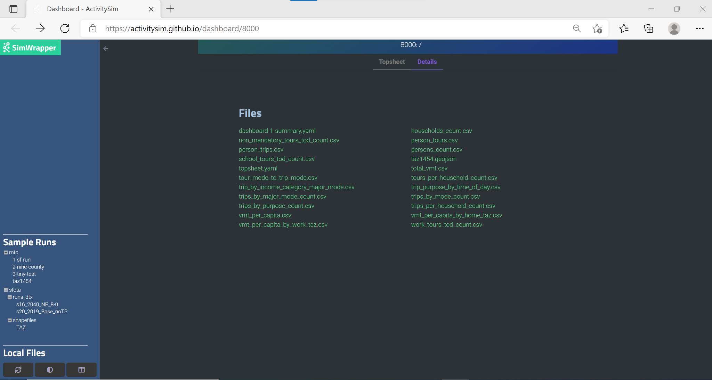

Core Components
===============

ActivitySim's core components include features for multiprocessing, data management,
utility expressions, choice models, person time window management, and helper
functions.  These core components include the multiprocessor, network LOS (skim) manager, the
data pipeline manager, the random number manager, the tracer, sampling
methods, simulation methods, model specification readers and expression
evaluators, choice models, timetable, transit virtual path builder, and helper functions.

.. _multiprocessing_in_detail:

Multiprocessing
---------------

Parallelization using multiprocessing

API
~~~

.. automodule:: activitysim.core.mp_tasks
   :members:


Data Management
---------------

Input
~~~~~

Input data table functions

API
^^^

.. automodule:: activitysim.core.input
   :members:

.. _los_in_detail:

LOS
~~~

Network Level of Service (LOS) data access

API
^^^

.. automodule:: activitysim.core.los
   :members:

Skims
~~~~~

Skims data access

API
^^^

.. automodule:: activitysim.core.skim_dict_factory
   :members:

.. automodule:: activitysim.core.skim_dictionary
   :members:

.. _pipeline_in_detail:

Pipeline
~~~~~~~~

Data pipeline manager, which manages the list of model steps, runs them, reads
and writes data tables from/to the pipeline datastore, and supports restarting of the pipeline
at any model step.

API
^^^

.. automodule:: activitysim.core.pipeline
   :members:

.. _random_in_detail:

Random
~~~~~~

ActivitySim's random number generation has a number of important features unique to AB modeling:

* Regression testing, debugging - run the exact model with the same inputs and get exactly the same results.
* Debugging models - run the exact model with the same inputs but with changes to expression files and get the same results except where the equations differ.
* Since runs can take a while, the above cases need to work with a restartable pipeline.
* Debugging Multithreading - run the exact model with different multithreading configurations and get the same results.
* Repeatable household-level choices - results for a household are repeatable when run with different sample sizes
* Repeatable household level results with different scenarios - results for a household are repeatable with different scenario configurations sequentially up to the point at which those differences emerge, and in alternate submodels in which those differences do not apply.

Random number generation is done using the `numpy Mersenne Twister PNRG <https://docs.scipy.org/doc/numpy/reference/generated/numpy.random.RandomState.html>`__.
ActivitySim seeds on-the-fly and uses a stream of random numbers seeded by the household id, person id, tour id, trip id, the model step offset, and the global seed.
The global seed can be set in the settings.yaml file using the ```rng_base_seed`` option.
The logic for calculating the seed is something along the lines of:

::

  chooser_table.index * number_of_models_for_chooser + chooser_model_offset + global_seed_offset

  for example
    1425 * 2 + 0 + 1
  where:
    1425 = household table index - households.id
    2 = number of household level models - auto ownership and cdap
    0 = first household model - auto ownership
    1 = global seed offset for testing the same model under different random global seeds

ActivitySim generates a separate, distinct, and stable random number stream for each tour type and tour number in order to maintain as much stability as is
possible across alternative scenarios.  This is done for trips as well, by direction (inbound versus outbound).

.. note::
   The Random module contains max model steps constants by chooser type - household, person, tour, trip - needs to be equal to the number of chooser sub-models.

API
^^^

.. automodule:: activitysim.core.random
   :members:

Tracing
~~~~~~~

Household tracer.  If a household trace ID is specified, then ActivitySim will output a
comprehensive set of trace files for all calculations for all household members:

* ``hhtrace.log`` - household trace log file, which specifies the CSV files traced. The order of output files is consistent with the model sequence.
* ``various CSV files`` - every input, intermediate, and output data table - chooser, expressions/utilities, probabilities, choices, etc. - for the trace household for every sub-model

With the set of output CSV files, the user can trace ActivitySim's calculations in order to ensure they are correct and/or to
help debug data and/or logic errors.

API
^^^

.. automodule:: activitysim.core.tracing
   :members:


.. _expressions:

Utility Expressions
-------------------

Much of the power of ActivitySim comes from being able to specify Python, pandas, and
numpy expressions for calculations. Refer to the pandas help for a general
introduction to expressions.  ActivitySim provides two ways to evaluate expressions:

* Simple table expressions are evaluated using ``DataFrame.eval()``.  `pandas' eval <http://pandas.pydata.org/pandas-docs/stable/generated/pandas.eval.html>`__ operates on the current table.
* Python expressions, denoted by beginning with ``@``, are evaluated with `Python's eval() <https://docs.python.org/2/library/functions.html#eval>`__.

Simple table expressions can only refer to columns in the current DataFrame.  Python expressions can refer to any Python objects currently in memory.

Conventions
~~~~~~~~~~~

There are a few conventions for writing expressions in ActivitySim:

* each expression is applied to all rows in the table being operated on
* expressions must be vectorized expressions and can use most numpy and pandas expressions
* global constants are specified in the settings file
* comments are specified with ``#``
* you can refer to the current table being operated on as ``df``
* often an object called ``skims``, ``skims_od``, or similar is available and is used to lookup the relevant skim information.  See :ref:`los_in_detail` for more information.
* when editing the CSV files in Excel, use single quote ' or space at the start of a cell to get Excel to accept the expression

Example Expressions File
~~~~~~~~~~~~~~~~~~~~~~~~

An expressions file has the following basic form:

+---------------------------------+---------------------------------+-------------------------------+-----------+---------------------------------+
| Label                           | Description                     |  Expression                   |     cars0 |    cars1                        |
+=================================+=================================+===============================+===========+=================================+
| util_drivers_2                  | 2 Adults (age 16+)              |  drivers==2                   |           |   coef_cars1_drivers_2          |
+---------------------------------+---------------------------------+-------------------------------+-----------+---------------------------------+
| util_persons_25_34              | Persons age 25-34               |  num_young_adults             |           |  coef_cars1_persons_25_34       |
+---------------------------------+---------------------------------+-------------------------------+-----------+---------------------------------+
| util_num_workers_clip_3         | Number of workers, capped at 3  |  @df.workers.clip(upper=3)    |           |   coef_cars1_num_workers_clip_3 |
+---------------------------------+---------------------------------+-------------------------------+-----------+---------------------------------+
| util_dist_0_1                   | Distance, from 0 to 1 miles     |  @skims['DIST'].clip(1)       |           |  coef_dist_0_1                  |
+---------------------------------+---------------------------------+-------------------------------+-----------+---------------------------------+

In the :ref:`tour_mode_choice` model expression file example shown below, the ``@c_ivt*(@odt_skims['SOV_TIME'] + dot_skims['SOV_TIME'])``
expression is travel time for the tour origin to destination at the tour start time plus the tour destination to tour origin at the tour end time.
The ``odt_skims`` and ``dot_skims`` objects are setup ahead-of-time to refer to the relevant skims for this model.  The ``@c_ivt`` comes from the
tour mode choice coefficient file.  The tour mode choice model is a nested logit (NL) model and the nesting structure (including nesting
coefficients) is specified in the YAML settings file.

+-----------------------------------------------------------+--------------------------------------------------------+------------------------------------------------+-----------------+---------------+
| Label                                                     | Description                                            |  Expression                                    | DRIVEALONEFREE  | DRIVEALONEPAY |
+===========================================================+========================================================+================================================+=================+===============+
| util_DRIVEALONEFREE_Unavailable                           | DRIVEALONEFREE - Unavailable                           | sov_available == False                         |            -999 |               |
+-----------------------------------------------------------+--------------------------------------------------------+------------------------------------------------+-----------------+---------------+
| util_DRIVEALONEFREE_In_vehicle_time                       | DRIVEALONEFREE - In-vehicle time                       | odt_skims['SOV_TIME'] + dot_skims['SOV_TIME']  |       coef_ivt  |               |
+-----------------------------------------------------------+--------------------------------------------------------+------------------------------------------------+-----------------+---------------+
| util_DRIVEALONEFREE_Unavailable_for_persons_less_than_16  | DRIVEALONEFREE - Unavailable for persons less than 16  | age < 16                                       |            -999 |               |
+-----------------------------------------------------------+--------------------------------------------------------+------------------------------------------------+-----------------+---------------+
| util_DRIVEALONEFREE_Unavailable_for_joint_tours           | DRIVEALONEFREE - Unavailable for joint tours           | is_joint == True                               |            -999 |               |
+-----------------------------------------------------------+--------------------------------------------------------+------------------------------------------------+-----------------+---------------+

* Rows are vectorized expressions that will be calculated for every record in the current table being operated on
* The Label column is the unique expression name (used for model estimation integration)
* The Description column describes the expression
* The Expression column contains a valid vectorized Python/pandas/numpy expression.  In the example above, ``drivers`` is a column in the current table.  Use ``@`` to refer to data outside the current table
* There is a column for each alternative and its relevant coefficient from the submodel coefficient file

There are some variations on this setup, but the functionality is similar.  For example,
in the example destination choice model, the size terms expressions file has market segments as rows and employment type
coefficients as columns.  Broadly speaking, there are currently four types of model expression configurations:

* Simple :ref:`simulate` choice model - select from a fixed set of choices defined in the specification file, such as the example above.
* :ref:`simulate_with_interaction` choice model - combine the choice expressions with the choice alternatives files since the alternatives are not listed in the expressions file.  The :ref:`non_mandatory_tour_destination_choice` model implements this approach.
* Combinatorial choice model - first generate a set of alternatives based on a combination of alternatives across choosers, and then make choices.  The :ref:`cdap` model implements this approach.

Expressions
~~~~~~~~~~~

The expressions class is often used for pre- and post-processor table annotation, which read a CSV file of expression, calculate
a number of additional table fields, and join the fields to the target table.  An example table annotation expressions
file is found in the example configuration files for households for the CDAP model -
`annotate_households_cdap.csv <https://github.com/activitysim/activitysim/blob/main/example/configs/annotate_households_cdap.csv>`__.

.. automodule:: activitysim.core.expressions
   :members:

Sampling with Interaction
~~~~~~~~~~~~~~~~~~~~~~~~~

Methods for expression handling, solving, and sampling (i.e. making multiple choices),
with interaction with the chooser table.

Sampling is done with replacement and a sample correction factor is calculated.  The factor is
calculated as follows:

::

  freq = how often an alternative is sampled (i.e. the pick_count)
  prob = probability of the alternative
  correction_factor = log(freq/prob)

  #for example:

  freq              1.00	2.00	3.00	4.00	5.00
  prob              0.30	0.30	0.30	0.30	0.30
  correction factor 1.20	1.90	2.30	2.59	2.81

As the alternative is oversampled, its utility goes up for final selection.  The unique set
of alternatives is passed to the final choice model and the correction factor is
included in the utility.

API
^^^

.. automodule:: activitysim.core.interaction_sample
   :members:

.. _simulate:

Simulate
~~~~~~~~

Methods for expression handling, solving, choosing (i.e. making choices) from a fixed set of choices
defined in the specification file.

API
^^^

.. automodule:: activitysim.core.simulate
   :members:

.. _simulate_with_interaction:

Simulate with Interaction
~~~~~~~~~~~~~~~~~~~~~~~~~

Methods for expression handling, solving, choosing (i.e. making choices),
with interaction with the chooser table.

API
^^^

.. automodule:: activitysim.core.interaction_simulate
   :members:

Simulate with Sampling and Interaction
~~~~~~~~~~~~~~~~~~~~~~~~~~~~~~~~~~~~~~

Methods for expression handling, solving, sampling (i.e. making multiple choices),
and choosing (i.e. making choices), with interaction with the chooser table.

API
^^^

.. automodule:: activitysim.core.interaction_sample_simulate
   :members:

Assign
~~~~~~

Alternative version of the expression evaluators in :mod:`activitysim.core.simulate` that supports temporary variable assignment.
Temporary variables are identified in the expressions as starting with "_", such as "_hh_density_bin".  These
fields are not saved to the data pipeline store.  This feature is used by the :ref:`accessibility` model.

API
^^^

.. automodule:: activitysim.core.assign
   :members:


Choice Models
-------------

.. _logit_in_detail:

Logit
~~~~~

Multinomial logit (MNL) or Nested logit (NL) choice model.  These choice models depend on the foundational components of ActivitySim, such
as the expressions and data handling described in the :ref:`how_the_system_works` section.

To specify and solve an MNL model:

* either specify ``LOGIT_TYPE: MNL`` in the model configuration YAML file or omit the setting
* call either ``simulate.simple_simulate()`` or ``simulate.interaction_simulate()`` depending if the alternatives are interacted with the choosers or because alternatives are sampled

To specify and solve an NL model:

* specify ``LOGIT_TYPE: NL`` in the model configuration YAML file
* specify the nesting structure via the NESTS setting in the model configuration YAML file.  An example nested logit NESTS entry can be found in ``example/configs/tour_mode_choice.yaml``
* call ``simulate.simple_simulate()``.  The ``simulate.interaction_simulate()`` functionality is not yet supported for NL.

API
^^^

.. automodule:: activitysim.core.logit
   :members:

.. _time_windows:

Person Time Windows
-------------------

The departure time and duration models require person time windows. Time windows are adjacent time
periods that are available for travel. Time windows are stored in a timetable table and each row is
a person and each time period (in the case of MTC TM1 is 5am to midnight in 1 hr increments) is a column.
Each column is coded as follows:

* 0 - unscheduled, available
* 2 - scheduled, start of a tour, is available as the last period of another tour
* 4 - scheduled, end of a tour, is available as the first period of another tour
* 6 - scheduled, end or start of a tour, available for this period only
* 7 - scheduled, unavailable, middle of a tour

A good example of a time window expression is ``@tt.previous_tour_ends(df.person_id, df.start)``.  This
uses the person id and the tour start period to check if a previous tour ends in the same time period.

API
~~~

.. automodule:: activitysim.core.timetable
   :members:

.. _transit_virtual_path_builder:

Transit Virtual Path Builder
----------------------------

Transit virtual path builder (TVPB) for three zone system (see :ref:`multiple_zone_systems`) transit path utility calculations.
TAP to TAP skims and walk access and egress times between MAZs and TAPs are input to the
demand model.  ActivitySim then assembles the total transit path utility based on the user specified TVPB
expression files for the respective components:

* from MAZ to first boarding TAP +
* from first boarding to final alighting TAP +
* from alighting TAP to destination MAZ

This assembling is done via the TVPB, which considers all the possible combinations of nearby boarding and alighting TAPs for each origin
destination MAZ pair and selects the user defined N best paths to represent the transit mode.  After selecting N best paths, the logsum across
N best paths is calculated and exposed to the mode choice models and a random number is drawn and a path is chosen. The boarding TAP,
alighting TAP, and TAP to TAP skim set for the chosen path is saved to the chooser table.

The initialize TVPB submodel (see :ref:`initialize_los`) pre-computes TAP to TAP total utilities for the user defined attribute_segments,
which are typically demographic segment (for example household income bin), time-of-day, and access/egress mode.  This submodel can be
run in both single process and multiprocess mode, with single process excellent for development/debugging and multiprocess excellent
for application.  ActivitySim saves the pre-calculated TAP to TAP total utilities to a memory mapped cache file for reuse by downstream models
such as tour mode choice.  In tour mode choice, the pre-computed TAP to TAP total utilities for the attribute_segment, along with the
access and egress impedances, are used to evaluate the best N TAP pairs for each origin MAZ destination MAZ pair being evaluated.
Assembling the total transit path impedance and then picking the best N is quick since it is done in a de-duplicated manner within
each chunk of multiprocessed choosers.

A model with TVPB can take considerably longer to run than a traditional TAZ based model since it does an order of magnitude more
calculations.  Thus, it is important to be mindful of your approach to your network model as well, especially the number of TAPs
accessible to each MAZ, which is the key determinant of runtime.

API
~~~

.. automodule:: activitysim.core.pathbuilder
   :members:


Cache API
~~~~~~~~~

.. automodule:: activitysim.core.pathbuilder_cache
   :members:

.. _visualization:

Visualization
-------------
Visualization capabilities are provided with SimWrapper, a standalone browser-based software that creates interactive, graphical visualizations of ActivitySim outputs. SimWrapper builds graphs and other visualization components from CSV summary tables that are produced by the *summarize* model step. Once the model run is complete, Simwrapper can be started and stopped at any time, independent of ActivitySim to visualize outputs. The tool currently allows users to view dashboards for multiple model runs side-by-side in the browser. The ability to compute and visualize the differences between two model runs is a planned future enhancement.

To use set up the summarize model to produce tables for SimWrapper, add ``summarize`` to the list of models in ``configs_mp/settings.yaml`` and add the following files to the `config` directory:

* ``summarize.yaml``: configuration for the summarize model step
* ``summarize.csv:`` expression file containing the final aggregations that will be generated at the end of the model run
* ``summarize_preprocessor.csv``: intermediate expression file used to add columns, including skim summaries, to the ``trips_merged`` pipeline table

In the output directory, add a new summarize directory, which must contain:

* ``dashboard-1-summary.yaml``: configuration for the layout and formatting of charts and other objects in the dashboard
* Additional ``dashboard-\*.yaml`` files may be used to configure additional dashboard tabs
* ``topsheet.yaml``: configuration for calculated statistics in the ‘At-a-Glance’ table at the top of the dashboard
* The ``/output/summarize`` directory may also contain one or more .geojson files to support map-based visualizations in the dashboard.

At present, example versions of all of the items above are located in the prototype MTC example model: ``/activitysim/examples/prototype_mtc``. Complete documentation for configuring dashboards is available in the `SimWrapper Docs <https://simwrapper.github.io/docs/simwrapper-intro>`_.


Configure the Summarize Model
~~~~~~~~~~~~~~~~~~~~~~~~~~~~~

Summary Expressions
^^^^^^^^^^^^^^^^^^^
Example configuration files for the summarize model step (as listed above) are included in prototype MTC example. These files will need to be adjusted to produce customized SimWrapper dashboards. These files are structured as standard ActivitySim expression (CSV) and configuration (YAML) files. More detailed information about configuration of the summarize model step is available in the Models documentation.

You may wish to manipulate the default expression files to suit your particular needs. Expression files are formatted as CSVs and structured according to ActivitySim conventions with three columns:

* ``Description``: Brief description of expression. Non-functional and may be left blank.
* ``Output``: Name of expression output. Will be used to name either the CSV or local variable storing the expression output.
* ``Expression``: Python expression that will be evaluated to produce the output.

Rows with output values that begin with an alphanumeric character will be saved to a CSV (e.g., ``output_name`` --> ``output_name.csv``). These expressions must yield a Pandas Series, DataFrame, or another object with a ``to_csv`` method.

Rows with output values that begin with underscores (e.g., ``_output_name``) will be stored as temporary variables in the local namespace so they can be used in following expressions. Expressions defining temporary variables can produce any data type. Users are encouraged to follow the ActivitySim convention using capitals to denote constants (e.g., ``_TEMP_CONSTANT``), though this convention is not formally enforced for summarize expressions.

Summarize expressions can make use of several convenience functions for binning numeric Pandas Series' into quantiles, equal intervals, or manually-specified ranges. These functions are available in the local namespace used to evaluate summarize expressions (as well as for preprocessing the ``trips_merged`` table; see below), so they can be used directly in summary expressions. These functions include:

* ``quantiles``: Construct quantiles from a Series given a number of bins.
* ``spaced_intervals``: Construct evenly-spaced intervals from a Series given a starting value and bin size.
* ``equal_intervals``: Construct equally-spaced intervals across the entire range of a Series.
* ``manual_breaks``: Classify numeric data in a Series into manually-defined bins.

For example population density quintiles could be calculated with the expression:
::

  quantiles(data=land_use.TOTPOP/land_use.TOTACRE, bins:5, label_format:'{rank}')

The ``label_format`` parameter uses f-string formatting to specify how bins should be labeled. Several named variables are automatically available in the local namespace for use in labels:

* ``left``: Left extent, or minimum, of the bin range
* ``mid``: Center of the bin range
* ``right``: Right extent, or maximum, of the bin range
* ``rank``: Numeric rank of the bin, with 1 being the lowest rank

By default, bins are labeled with their extents using the following f-string: ``'{left:,.2f} - {right:,.2f}'``. The ``'{rank}'`` option demonstrated above would label each bin with its ordinal rank. Numeric labels are converted to numeric data types, if possible.

Examples of each summarize function are included in the ``summarize.csv`` expression file for the prototype MTC example. Consult the docstrings for each function in the ``/activitysim/abm/models/summarize.py`` module for complete specification of parameters.

Preprocessing
^^^^^^^^^^^^^
Pipeline tables available for summarization can be preprocessed to include columns that bin or aggregate existing columns into categories or add skim data related to trips or tours. Preprocessing is configured both in ``summarize.yaml`` and ``summarize_preprocessor.csv``.

Binning and aggregation operations that should take place *before* expressions are calculated, in order to produce a new column in a pipeline table, can be specified in ``summarize.yaml``. This can be useful for reducing clutter and redundancy in the summary expressions file.

Binning during the preprocessing stage uses the same convenience functions available for expression files but specifies them in the configuration YAML. To calculate manually-defined income categories, for example, the YAML would include:

::

  persons_merged:                      # Pipeline table on which to operate
    BIN:
      # Manually-specified bins
      - column: income                 # Column on which to operate
        label: income_category         # New column to make
        type: manual_breaks            # Binning function
        bin_breaks:                    # Must include lower and upper extents;
          - 0                          # (One more value than the number of bins)
          - 25000
          - 50000
          - 75000
          - 100000
          - 999999
        bin_labels:                    # (optional)
          - Very Low Income ($0-$25k)
          - Low Income ($25k-$50k)
          - Medium Income ($50k-$75k)
          - High Income ($75k-$100k)
          - Very High Income (>$100k)

Example uses of each binning function are included in the ``summarize.yaml`` configuration file in the prototype MTC example.

Table columns can also be aggregated, or "remapped," during the preprocessing stage. Aggregations are specified in the configuration YAML using a key-value  structure:

::

  trips_merged:                        # Pipeline table on which to operate
    AGGREGATE:
      - column: major_trip_mode        # Column on which to operate
        label: major_trip_mode         # New column to make
        map:
          DRIVEALONEFREE: SOV          # Keys: Existing values to map from
          DRIVEALONEPAY: SOV           # Values: New values to map to
          SHARED2FREE: HOV
          SHARED2PAY: HOV
          SHARED3FREE: HOV
          SHARED3PAY: HOV
          WALK_LOC: Transit
          WALK_LRF: Transit
          WALK_EXP: Transit
          WALK_HVY: Transit
          WALK_COM: Transit
          DRIVE_LOC: Transit
          DRIVE_LRF: Transit
          DRIVE_EXP: Transit
          DRIVE_HVY: Transit
          DRIVE_COM: Transit
          DRIVEACCESS: Transit
          WALK: Non-Motorized
          BIKE: Non-Motorized
          TAXI: Ride Hail
          TNC_SINGLE: Ride Hail
          TNC_SHARED: Ride Hail


Trip-level skim data are also made available in the preprocessing stage by attaching columns to the ``trips_merged`` table based on expressions in ``summarize_preprocessor.csv``. This process uses skim wrappers indexed by origin, destination, and time of day to gather distance, time, and cost data and each trip, enabling calculation of variables such as vehicle miles traveled (VMT). Preprocessing expressions are interpreted with standard ActivitySim annotation methods, including definition of scalar and vector temporary variables based on underscores and capitalization. The preprocessor expressions included in the prototype MTC example demonstrate calculation of a number of skim-based variables involving distance, time, and cost. The system for joining skim data to trips is currently configured for the one-zone MTC example model and will need to be generalized for multi-zone systems in future work.


Install and Run Simwrapper
~~~~~~~~~~~~~~~~~~~~~~~~~~
The SimWrapper Python package, which contains convenience functions for initiating the SimWrapper app in the browser and a local file server for accessing summary tables from this app, is automatically installed as a dependency of ActivitySim. However, you can also use SimWrapper independent of ActivitySim to, for example, visualize summaries on a different workstation. SimWrapper is available on both conda-forge and pip:
::

  > conda install -c conda-forge simwrapper

or

  > pip install simwrapper

The latest information about the Simwrapper package is available on its `PyPI page <https://pypi.org/project/simwrapper/>`_.

To run SimWrapper, navigate on the command line to ``output\summarize`` within the model directory, or a directory where you may have copied outputs, and run:
::

  > simwrapper open asim

This will start SimWrapper in your default browser. If this directory contains the appropriate configuration files for a dashboard (see above), the dashboard will open automatically. Otherwise, SimWrapper will show a file browser with the contents of the directory.


Navigate SimWrappper
~~~~~~~~~~~~~~~~~~~~
When Simwrapper launches, the dashboard is displayed in the scrollable field in the main part of the browser window, and there are
two sets of navigation controls.  The left-hand sidebar contains a menu of the available simulation outputs you can access from the
current directory, including a number of sample outputs:

.. image:: images/viz_nav-1.png

The header and tabs at the top of the page help you navigate within the simulation run that is currently being visualized:

.. image:: images/viz_nav-2.png

Clicking on ‘Details’ will switch from the visualizations view to a current directory listing to facilitate viewing and downloading of
the code and raw data used to create the dashboard:



Clicking on ‘Topsheet’ returns you to the visualization graphics page.  The three buttons in the lower left corner provide additional
functionality to:

1. re-sync with the latest version of the output files,
2. toggle light theme vs. dark theme, and
3. split the visualization window into two separate panels like this:

.. image:: images/viz_nav-4.png

Before starting the split-screen view, choose the model run that you want to appear in the right side pane (‘1-sf-run’ in the image above).
Then, click on the split view button to divide the window into two visualization panels.  Finally, use the left-hand navigation pane to
change the comparison run on the left side (‘2-nine-county’ in the image above).

Each side of the split screen has independent header navigation (Topsheet vs. Details) and independent vertical and horizontal scrolling.
However, panning and zooming on any one map object controls all maps on both sides of the split view at the same time:

.. image:: images/viz_nav-5.png

.. _helpers:

Helpers
-------

.. index:: chunk_size
.. _chunk_size:
.. _chunk_in_detail:

Chunk
~~~~~

Chunking management.

.. note::
   The definition of chunk_size has changed from previous versions of ActivitySim.  The revised definition
   of chunk_size simplifies model setup since it is the approximate amount of RAM available to
   ActivitySim as opposed to the obscure number of doubles (64-bit numbers) in a chunk of a choosers table.

The ``chunk_size`` is the approximate amount of RAM in bytes (1 Gigabyte or 1 GB is equal to 1,000,000,000 bytes) to allocate to ActivitySim for batch
processing choosers across all processes.  It is specified in bytes, for example ``chunk_size: 500_000_000_000`` is 500 GBs.
If set ``chunk_training_mode: disabled`` then no chunking will be performed and ActivitySim will attempt to solve all the
choosers at once across all the processes.  Chunking is required when all the chooser data required to process all the
choosers cannot fit within the available RAM and so ActivitySim must split the choosers into batches and then process the batches in sequence.

Configuration of the ``chunk_size`` depends on several parameters:

* The amount of machine RAM
* The number of machine processors (CPUs/cores)
* The number of households (and number of zones for aggregate models)
* The amount of headroom required for shared data across processes, such as the skims/network LOS data
* The desired runtimes

An example helps illustrate configuration of the ``chunk_size``.  If the example model has 1 million households and the
current submodel is auto ownership, then there are 1 million choosers since every household participates in the auto
ownership model.  In single process mode, ActivitySim would create one chooser table with 1 million rows, assuming this table
and the additional extra data such as the skims can fit within the available memory (RAM).  If the 1 million row table cannot fit
within memory then chunking needs to be setup to split the choosers table into batches that are processed in sequence and small
enough to fit within the available memory.  For example, the choosers table is split into 2 chunks of 500,000 choosers each and then
processed in sequence.  In multi process mode, for example with 10 processes, ActivitySim splits the 1 million households into 10
mini processes each with 100,000 households.  Then for the auto ownership submodel, the chooser table within each process is the
100,000 choosers and there must be enough RAM to simultaneously solve all 10 processes with each 100,000 choosers at once.  If not,
then chunking can be setup so each mini process table of choosers is split into chunks for sequential processing, for example from
10 tables of 100,000 choosers to 20 tables of 50,000 choosers.

If the user desires the fastest runtimes possible given their hardware, model inputs, and model configuration, then ActivitySim
should be configured to use most of the CPUs/cores (physical, not virtual), most of the RAM, and with the :ref:`mkl_settings`. For
example, if the machine has 12 cores and 256 GB of RAM, then try configuring the model with ``num_processes: 10`` and
``chunk_size: 0`` to start and seeing if the model can fit the problem into the available RAM.  If not, then try setting ``chunk_size``
to something like 225 GB, ``chunk_size: 225_000_000_000``.  Experimentation of the desired configuration of the CPUs and RAM should be done
for each new machine and model setup (with respect to the number of households, skims, and model configuration).  In general, more processors
means faster runtimes and more RAM means faster runtimes, but the relationship of processors to RAM is not linear as processors can only
go so fast and because there is more to runtime than processors and RAM, including cache speed, disk speed, etc.  Also, the amount of RAM
to use is approximate and ActivitySim often pushes a bit above the user specified amount due to pandas/numpy memory spikes for
memory intensive operations and so it is recommended to leave some RAM unallocated.  The exact amount to leave unallocated depends on the
parameters above.

To configure chunking behavior, ActivitySim must first be trained with the model setup and machine.  To do so, first
run the model with ``chunk_training_mode: training``.  This tracks the amount of memory used by each table by submodel and writes the results
to a cache file that is then re-used for production runs.  This training mode is significantly slower than production mode since it does
significantly more memory inspection.  For a training mode run, set ``num_processors`` to about 80% of the avaiable logical processors and ``chunk_size``
to about 80% of the available RAM.  This will run the model and create the ``chunk_cache.csv`` file in output\cache for reuse.  After creating
the chunk cache file, the model can be run with ``chunk_training_mode: production`` and the desired ``num_processors`` and ``chunk_size``.  The
model will read the chunk cache file from the output\cache folder, similar to how it reads cached skims if specified.
The software trains on the size of problem so the cache file can be re-used and only needs to be updated due to significant revisions in population,
expression, skims/network LOS, or changes in machine specs.  If run in production mode and no cache file is found then ActivitySim falls
back to training mode.  A third ``chunk_training_mode`` is adaptive, which if a cache file exists, runs the model with the starting cache
settings but also updates the cache settings based on additional memory inspection.  This may additionally improve the cache setttings to
reduce runtimes when run in production mode.  If ``resume_after`` is set, then the chunk cache file is not overwritten in cache directory
since the list of submodels would be incomplete.  A foruth ``chunk_training_mode`` is disabled, which assumes the model can be run without
chunking due to an abundance of RAM.

The following ``chunk_methods`` are supported to calculate memory overhead when chunking is enabled:

* bytes - expected rowsize based on actual size (as reported by numpy and pandas) of explicitly allocated data this can underestimate overhead due to transient data requirements of operations (e.g. merge, sort, transpose)
* uss - expected rowsize based on change in (unique set size) (uss) both as a result of explicit data allocation, and readings by MemMonitor sniffer thread that measures transient uss during time-consuming numpy and pandas operations
* hybrid_uss - hybrid_uss avoids problems with pure uss, especially with small chunk sizes (e.g. initial training chunks) as numpy may recycle cached blocks and show no increase in uss even though data was allocated and logged
* rss - like uss, but for resident set size (rss), which is the portion of memory occupied by a process that is held in RAM
* hybrid_rss - like hybrid_uss, but for rss

RSS is reported by psutil.memory_info and USS is reported by psutil.memory_full_info.  USS is the memory which is private to
a process and which would be freed if the process were terminated.  This is the metric that most closely matches the rather
vague notion of memory "in use" (the meaning of which is difficult to pin down in operating systems with virtual memory
where memory can (but sometimes can't) be swapped or mapped to disk.  ``hybrid_uss`` performs best and is most reliable and
is therefore the default.

Additional chunking settings:

* min_available_chunk_ratio: 0.05 - minimum fraction of total chunk_size to reserve for adaptive chunking
* default_initial_rows_per_chunk: 500 - initial number of chooser rows for first chunk in training mode, when there is no pre-existing chunk_cache to set initial value, ordinarily bigger is better as long as it is not so big it causes memory issues (e.g. accessibility with lots of zones)
* keep_chunk_logs: True - whether to preserve or delete subprocess chunk logs when they are consolidated at end of multiprocess run
* keep_mem_logs: True - whether to preserve or delete subprocess mem logs when they are consolidated at end of multiprocess run


API
^^^

.. automodule:: activitysim.core.chunk
   :members:

Utilities
~~~~~~~~~

Vectorized helper functions

API
^^^

.. automodule:: activitysim.core.util
   :members:

Config
~~~~~~

Helper functions for configuring a model run

API
^^^

.. automodule:: activitysim.core.config
   :members:

.. _inject:

Inject
~~~~~~

Model orchestration and data pipeline interaction.

API
^^^

.. automodule:: activitysim.core.inject
   :members:

Mem
~~~

Helper functions for tracking memory usage

API
^^^

.. automodule:: activitysim.core.mem
   :members:

Output
~~~~~~

Write output files and track skim usage.

API
^^^

.. automodule:: activitysim.core.steps.output
   :members:

Tests
~~~~~

See activitysim.core.test
