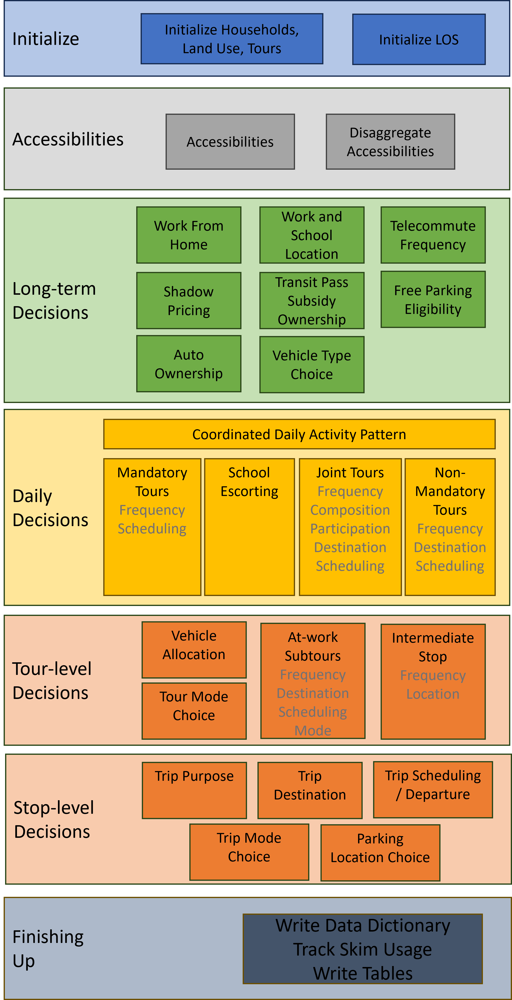

How the System Works
====================

This page describes how the software works, how multiprocessing works, and the primary example model data schema.  The code snippets below may not exactly match the latest version of the software, but they are close enough to illustrate how the system works.

.. _how_the_system_works:

Execution Flow
--------------

An example model run starts by running the steps in :ref:`example_run`. The following flow chart represents steps of ActivitySim, but specific implementations will have different individual model components in their execution.

Initialization
~~~~~~~~~~~~~~

The first significant step of the ``run`` command is:

::

  from activitysim import abm

which loads :mod:`activitysim.abm.__init__`, which calls:

::

   import misc
   import tables
   import models

which then loads the misc, tables, and models class definitions.  Loading :mod:`activitysim.abm.misc` calls:

::

   from activitysim.core import config
   from activitysim.core import inject

which loads the config and inject classes.  These define Inject injectables (functions) and
helper functions for running models.  For example, the Python decorator ``@inject.injectable`` overrides the function definition ``settings`` to
execute this function whenever the ``settings`` object is called by the system.  The :mod:`activitysim.core.inject` manages the data
pipeline.

::

   @inject.injectable(cache=True)
   def settings():
       settings_dict = read_settings_file('settings.yaml', mandatory=True)
       return settings_dict

Next, the tables module executes the following import statements in :mod:`activitysim.abm.tables.__init__` to
define the dynamic inject tables (households, persons, skims, etc.), but does not load them. It also defines the
core dynamic injectables (functions) defined in the classes. The Python decorator ``@inject.table`` override the function
definitions so the name of the function becomes the name of the table when dynamically called by the system.

::

  from . import households
  from . import persons
  #etc...

  #then in households.py
  @inject.table()
  def households(households_sample_size, override_hh_ids, trace_hh_id):

The models module then loads all the sub-models, which are registered as model steps with
the ``@inject.step()`` decorator.  These steps will eventually be run by the data pipeliner.

::

  from . import accessibility
  from . import atwork_subtour_destination
  from . import atwork_subtour_frequency
  #etc...

  #then in accessibility.py
  @inject.step()
  def compute_accessibility(accessibility, network_los, land_use, trace_od):

Back in the main ``run`` command, the next steps are to load the tracing, configuration, setting, and pipeline classes
to get the system management components up and running.

::

  from activitysim.core import tracing
  from activitysim.core import config
  from activitysim.core import pipeline

The next step in the example is to define the ``run`` method, call it if the script is being run as the program entry point, and handle the
arguments passed in via the command line.

::

  def run():
    #etc...

  if __name__ == '__main__':
    run()

.. note::
   For more information on run options, type ``activitysim run -h`` on the command line

The first key thing that happens in the ``run`` function is ``resume_after = setting('resume_after', None)``, which causes the system
to go looking for ``setting``.  Earlier we saw that ``setting`` was defined as an injectable and so the system gets this object if it
is already in memory, or if not, calls this function which loads the ``config/settings.yaml`` file.  This is called lazy loading or
on-demand loading. Next, the system loads the models list and starts the pipeline:

::

  pipeline.run(models=setting('models'), resume_after=resume_after)

The :func:`activitysim.core.pipeline.run` method loops through the list of models, calls ``inject.run([step_name])``,
and manages the data pipeline.  The first disaggregate data processing step (or model) run is ``initialize_households``, defined in
:mod:`activitysim.abm.models.initialize`.  The ``initialize_households`` step is responsible for requesting reading of the raw
households and persons into memory.

Initialize Households
~~~~~~~~~~~~~~~~~~~~~

The initialize households step/model is run via:

::

   @inject.step()
   def initialize_households():

      trace_label = 'initialize_households'
      model_settings = config.read_model_settings('initialize_households.yaml', mandatory=True)
      annotate_tables(model_settings, trace_label)

This step reads the ``initialize_households.yaml`` config file, which defines the :ref:`table_annotation` below.  Each table
annotation applies the expressions specified in the annotate spec to the relevant table.  For example, the ``persons`` table
is annotated with the results of the expressions in ``annotate_persons.csv``.  If the table is not already in memory, then
inject goes looking for it as explained below.

::

   #initialize_households.yaml
   annotate_tables:
     - tablename: persons
       annotate:
         SPEC: annotate_persons
         DF: persons
         TABLES:
           - households
     - tablename: households
       column_map:
         PERSONS: hhsize
         workers: num_workers
       annotate:
         SPEC: annotate_households
         DF: households
         TABLES:
           - persons
           - land_use
     - tablename: persons
       annotate:
         SPEC: annotate_persons_after_hh
         DF: persons
         TABLES:
           - households

   #initialize.py
   def annotate_tables(model_settings, trace_label):

    annotate_tables = model_settings.get('annotate_tables', [])

    for table_info in annotate_tables:

        tablename = table_info['tablename']
        df = inject.get_table(tablename).to_frame()

        # - annotate
        annotate = table_info.get('annotate', None)
        if annotate:
            logger.info("annotated %s SPEC %s" % (tablename, annotate['SPEC'],))
            expressions.assign_columns(
                df=df,
                model_settings=annotate,
                trace_label=trace_label)

        # - write table to pipeline
        pipeline.replace_table(tablename, df)

Remember that the ``persons`` table was previously registered as an injectable table when the persons table class was
imported.  Now that the ``persons`` table is needed, inject calls this function, which requires the ``households`` and
``trace_hh_id`` objects as well.  Since ``households`` has yet to be loaded, the system run the households inject table operation
as well.  The various calls also setup logging, tracing, stable random number management, etc.

::

  #persons in persons.py requires households, trace_hh_id
  @inject.table()
  def persons(households, trace_hh_id):

    df = read_raw_persons(households)

    logger.info("loaded persons %s" % (df.shape,))

    df.index.name = 'person_id'

    # replace table function with dataframe
    inject.add_table('persons', df)

    pipeline.get_rn_generator().add_channel('persons', df)

    if trace_hh_id:
        tracing.register_traceable_table('persons', df)
        whale.trace_df(df, "raw.persons", warn_if_empty=True)

    return df

  #households requires households_sample_size, override_hh_ids, trace_hh_id
  @inject.table()
  def households(households_sample_size, override_hh_ids, trace_hh_id):

    df_full = read_input_table("households")

The process continues until all the dependencies are resolved.  It is the ``read_input_table`` function that
actually reads the input tables from the input HDF5 or CSV file using the ``input_table_list`` found in ``settings.yaml``

::

  input_table_list:
    - tablename: households
      filename: households.csv
      index_col: household_id
      column_map:
        HHID: household_id

Running Model Components
~~~~~~~~~~~~~~~~~~~~~~~~

The next steps include running the model components specific to the individual implementation that you are running and as specified in the ``settings.yaml`` file.

Finishing Up
~~~~~~~~~~~~

The last models to be run by the data pipeline are:

* ``write_data_dictionary``, which writes the table_name, number of rows, number of columns, and number of bytes for each checkpointed table
* ``track_skim_usage``, which tracks skim data memory usage
* ``write_tables``, which writes pipeline tables as CSV files as specified by the output_tables setting

Back in the main ``run`` command, the final steps are to:

* close the data pipeline (and attached HDF5 file)

Components
----------

Individual models and components are defined and described in the Developers Guide. Please refer to the :ref:`Components<dev_components>` section.
