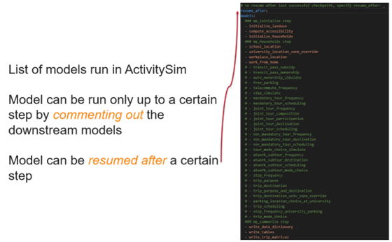

Ways to Run the Model
=====================

This section describes the different ways by which an ActivitySim Model can be run.

Options to Execute a Model
--------------------------

Using the Command Line Interface
________________________________

ActivitySim's **Command Line Interface (CLI)** allows the user to create examples and run models through quick DOS commands. This functionality gives users a better way to distribute multiple examples/run the model. The CLI functionality also enables to run ActivitySim across different platforms -  Linux, Windows, and macOS.

ActivitySim includes a :ref:`cli` for creating examples and running the model.  See ``activitysim -h`` for
more information.

.. note::
   The `example_manifest.yaml <https://github.com/ActivitySim/activitysim/blob/main/activitysim/examples/example_manifest.yaml>`_
   contains example commands to create and run several versions of the examples.

Create
++++++

Create an ActivitySim example setup.  See ``activitysim create -h`` for more information.
More complete examples, including the full scale prototype MTC
regional demand model are available for creation by typing ``activitysim create -l``.  To create
these examples, ActivitySim downloads the large input files from
the `ActivitySim resources <https://github.com/rsginc/activitysim_resources>`__ repository.

API
~~~

.. automodule:: activitysim.cli.create
   :members:

Run
+++

Run ActivitySim.  See ``activitysim run -h`` for more information.

.. index:: _settings_file_inheritance
.. _settings_file_inheritance :

Settings File Inheritance
~~~~~~~~~~~~~~~~~~~~~~~~~

ActivitySim model runs can be configured with settings file inheritance to avoid
duplicating settings across model configurations. The command below runs ActivitySim
with two configs folders - ``configs`` and ``configs_mp``.  This setup allows for overriding setings
in the configs folder with additional settings in the configs_mp folder so that
expression files and settings in the single process (e.g. configs folder) can be re-used for
the multiprocessed setup (e.g. configs_mp folder).  Settings files, as opposed to configs folders,
can also be inherited by specifying ``-s`` multiple times.  See ``activitysim run -h`` for
more information.

::

  # in configs_mp\settings.yaml
  inherit_settings: True

  #then on the command line
  activitysim run -c configs_mp -c configs -d data -o output

API
~~~

.. automodule:: activitysim.cli.run
   :members:

Running the Primary Example using CLI
+++++++++++++++++++++++++++++++++++++

Refer to the :ref:`Run the Primary Example` section to learn how to run the primary ActivitySim example model using the Command Line Interface.

Using Jupyter Notebook
______________________

ActivitySim includes a `Jupyter Notebook <https://jupyter.org>`__ recipe book with interactive examples.  To run a Jupyter notebook, do the following:

* Open a conda prompt and activate the conda environment with ActivitySim installed
* If needed, ``conda install jupyterlab`` so you can run jupyter notebooks
* Type ``jupyter notebook`` to launch the web-based notebook manager
* Navigate to the ``examples/prototype_mtc/notebooks`` folder and select a notebook to learn more:

  * `Getting started <https://github.com/ActivitySim/activitysim/blob/main/activitysim/examples/prototype_mtc/notebooks/getting_started.ipynb/>`__
  * `Summarizing results <https://github.com/ActivitySim/activitysim/blob/main/activitysim/examples/prototype_mtc/notebooks/summarizing_results.ipynb/>`__
  * `Testing a change in auto ownership <https://github.com/ActivitySim/activitysim/blob/main/activitysim/examples/prototype_mtc/notebooks/change_in_auto_ownership.ipynb/>`__
  * `Adding TNCs <https://github.com/ActivitySim/activitysim/blob/main/activitysim/examples/prototype_mtc/notebooks/adding_tncs.ipynb/>`__
  * `Memory usage <https://github.com/ActivitySim/activitysim/blob/main/activitysim/examples/prototype_mtc/notebooks/memory_usage.ipynb/>`__

Running Select Components of the Model
--------------------------------------

ActivitySim can be run for all components in any model implementation, or a select set of components. If running the model for a subset of model components, the upstream model components would need to have been run first. For example, if you want to rerun just tour mode choice, all of the steps before tour mode choice would need to have been run. This is described below:

* To only run the model up to a certain step, simply comment out (add # at the beginning of the line) all the model steps following that model.
* To resume the model run after a successfully-run previous step, add the name of the step in front of the resume after line.

The below figure shows an example of the settings.yaml file to run select components of ActivitySim.

Advanced Configuration
----------------------

There are several ways to maximize the performance of the model run, either to be able to run the model within the given hardware limitations (such as available RAM) or to reduce the run times. This section describes the various options and settings available in ActivitySim to improve the model run performance.

.. _chunking_ways_to_run :

Chunking
________

Chunking is designed to divide up the computations in chunks, to reduce the amount of memory needed to complete computations,
and then combine the data. This process will increase run time but may be a good option if the maximum RAM required to run the
model is more than the hardware available.

Refer to the :ref:`Chunking <Chunk>` section for more details on how to configure and run ActivitySim with chunking.

In general, before running ActivitySim for the first time on a new machine, it needs to be run in training_mode to efficiently handle memory usage (to set the appropriate chunking size). RSG, however, has ran the model in training mode once and has successfully used the cache on different machines. So in general, the provided cache.csv should help run the model on a different server as well.

However, should the model crash with an OutofMemory error on a first attempt on a new machine, ActivitySim should be run in training mode first to generate a new cache.csv file. To do so, change the chunk_training_mode line to training in the settings_source.yaml file, set household_sample_size: 0 and chunk_size to 80% of the available RAM on the machine (value is in bytes, so a value of 200_000_000_000 is equivalent to 200GB).

For example, in the SEMCOG model, following settings can be changed to enable chunking
•	``households_sample_size``: to set the number of households to run the model with.
•	``chunk_size``: to set the available RAM in the machine to use to run ActivitySim
•	``num_processes`` line to set how many CPU physical cores to use to run the model
•	``chunk_training_mode`` line sets what mode to run the model in. The options include “training”, and “production”.
    In training, the model runs once to estimate the best way to allocate memory to run each step, and then saves the information
    in cache.csv for later runs. The production mode makes use of this information to run the model more efficiently. the next
    subsection discusses more details on how to run the model in training mode.

.. _multi_proc_ways_to_run :

Multiprocessing
________________

Most models can be implemented as a series of independent vectorized operations on pandas DataFrames and
numpy arrays. These vectorized operations are much faster than sequential Python because they are
implemented by native code (compiled C) and are to some extent multi-threaded. But the benefits of
numpy multi-processing are limited because they only apply to atomic numpy or pandas calls, and as
soon as control returns to Python it is single-threaded and slow.

Multi-threading is not an attractive strategy to get around the Python performance problem because
of the limitations imposed by Python's global interpreter lock (GIL). Rather than struggling with
Python multi-threading, ActivitySim uses the
Python `multiprocessing <https://docs.python.org/2/library/multiprocessing.html>`__ library to parallelize
most models.

ActivitySim's modular and extensible architecture makes it possible to not hardwire the multiprocessing
architecture. The specification of which models should be run in parallel, how many processers
should be used, and the segmentation of the data between processes are all specified in the
settings config file.

Multiprocessing Configuration
~~~~~~~~~~~~~~~~~~~~~~~~~~~~~

The multiprocess_steps setting below indicate that the simulation should be broken into three steps.

::

    models:
      ### mp_initialize step
      - initialize_landuse
      - compute_accessibility
      - initialize_households
      ### mp_households step
      - school_location
      - workplace_location
      - auto_ownership_simulate
      - free_parking
      ### mp_summarize step
      - write_tables

    multiprocess_steps:
      - name: mp_initialize
        begin: initialize_landuse
      - name: mp_households
        begin: school_location
        num_processes: 2
        slice:
          tables:
            - households
            - persons
      - name: mp_summarize
        begin: write_tables

The first multiprocess_step, ``mp_initialize``, begins with the initialize landuse step and is
implicity single-process because there is no 'slice' key indicating how to apportion the tables.
This first step includes all models listed in the 'models' setting up until the first step
in the next multiprocess_steps.

The second multiprocess_step, ``mp_households``, starts with the school location model and continues
through auto ownership. The 'slice' info indicates that the tables should be sliced by
``households``, and that ``persons`` is a dependent table and so ``persons`` with a ref_col (foreign key
column with the same name as the ``Households`` table index) referencing a household record should be
taken to 'belong' to that household. Similarly, any other table that either share an index
(i.e. having the same name) with either the ``households`` or ``persons`` table, or have a ref_col to
either of their indexes, should also be considered a dependent table.

The num_processes setting of 2 indicates that the pipeline should be split in two, and half of the
households should be apportioned into each subprocess pipeline, and all dependent tables should
likewise be apportioned accordingly. All other tables (e.g. ``land_use``) that do share an index (name)
or have a ref_col should be considered mirrored and be included in their entirety.

The primary table is sliced by num_processes-sized strides. (e.g. for num_processes == 2, the
sub-processes get every second record starting at offsets 0 and 1 respectively. All other dependent
tables slices are based (directly or indirectly) on this primary stride segmentation of the primary
table index.

Two separate sub-process are launched (num_processes == 2) and each passed the name of their
apportioned pipeline file. They execute independently and if they terminate successfully, their
contents are then coalesced into a single pipeline file whose tables should then be essentially
the same as it had been generated by a single process.

We assume that any new tables that are created by the sub-processes are directly dependent on the
previously primary tables or are mirrored. Thus we can coalesce the sub-process pipelines by
concatenating the primary and dependent tables and simply retaining any copy of the mirrored tables
(since they should all be identical.)

The third multiprocess_step, ``mp_summarize``, then is handled in single-process mode and runs the
``write_tables`` model, writing the results, but also leaving the tables in the pipeline, with
essentially the same tables and results as if the whole simulation had been run as a single process.

Shared Data
~~~~~~~~~~~

Although multiprocessing subprocesses each have their apportioned pipeline, they also share some
data passed to them by the parent process:

  * read-only shared data such as skim matrices
  * read-write shared memory when needed.  For example when school and work modeled destinations by zone are compared to target zone sizes (as calculated by the size terms).

Outputs
~~~~~~~

When multiprocessing is run, the following additional outputs are created, which are useful for understanding how multiprocessing works:

  * run_list.txt - which contains the expanded model run list with additional annotation for single and multiprocessed steps
  * Log files for each multiprocess step and process, for example ``mp_households_0-activitysim.log`` and ``mp_households_1-activitysim.log``
  * Pipeline file for each multiprocess step and process, for example ``mp_households_0-pipeline.h5``
  * mem.csv - memory used for each step
  * breadcrumbs.yaml - multiprocess global info

See the :ref:`multiprocessing_in_detail` section for more detail.

.. index:: data tables
.. index:: tables
.. index:: data schema

.. _sharrow_ways_to_run :

Sharrow
_______

`Sharrow <https://activitysim.github.io/sharrow/intro.html>`__ is a Python library designed to decrease run-time for ActivitySim models. The sharrow package is an extension of *numba*, and offers access to data formatting and a just-in-time compiler specifically for converting ActivitySim-style “specification” files into optimized, runnable functions that can significantly reduce the amount of run-time. The idea is to pay the cost of compiling these specification files only once, and then re-use the optimized results many times. If there is a change to the utility functions, machine, core, or the user deletes the cached files, this will automatically trigger a recompiling process.

Please refer to `Sharrow installation <https://activitysim.github.io/sharrow/intro.html#installation>`__ for details on how to install Sharrow. Details on using Activitysim with Sharrow can be found in the :ref:`Using Sharrow` section of the Developer's Guide. More details on Sharrow features can be found in the `Sharrow user guide <https://activitysim.github.io/sharrow/walkthrough/index.html>`__.

.. _tracing_ways_to_run :

Tracing
_______

Tracing allows the user to access information throughout the model run for a specified number of households/persons/zones. Enabling this feature will increase run-time and memory usage. It is recommended that this feature be turned off for typical model application.

There are two types of tracing in ActivtiySim: household and origin-destination (OD) pair.  If a household trace ID
is specified, then ActivitySim will output a comprehensive set (i.e. hundreds) of trace files for all
calculations for all household members:

* ``Several CSV files`` - each input, intermediate, and output data table - chooser, expressions/utilities, probabilities, choices, etc. - for the trace household for each sub-model

If an OD pair trace is specified, then ActivitySim will output the acessibility calculations trace
file:

* ``accessibility.result.csv`` - accessibility expression results for the OD pair

With the set of output CSV files, the user can trace ActivitySim calculations in order to ensure they are correct and/or to
help debug data and/or logic errors.

Refer to :ref:`trace` for more details on configuring tracing and the various output files.
